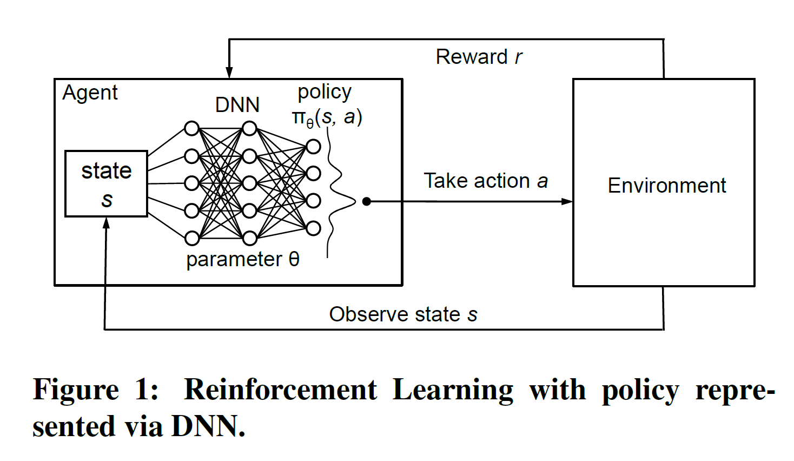
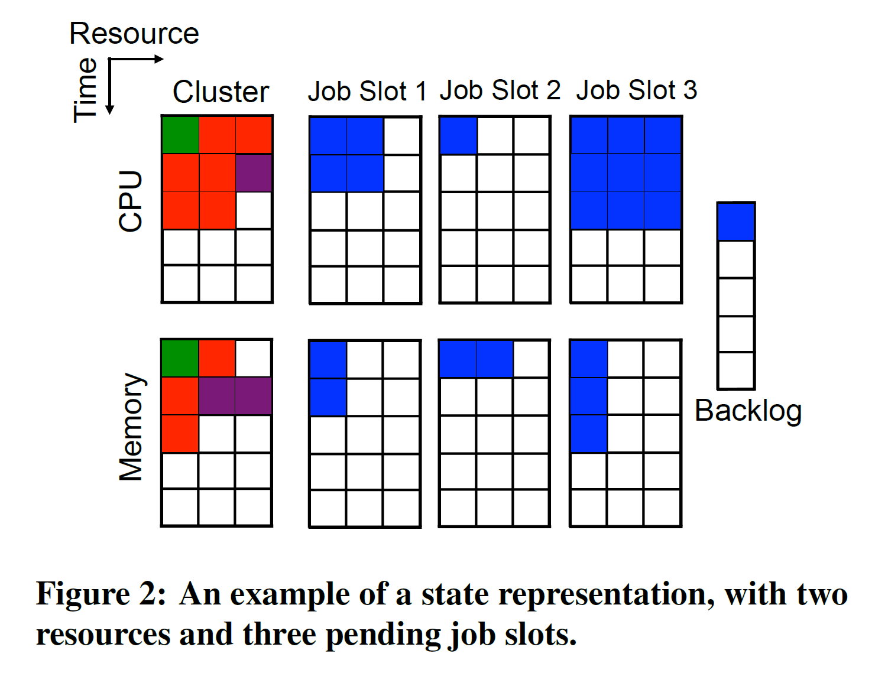
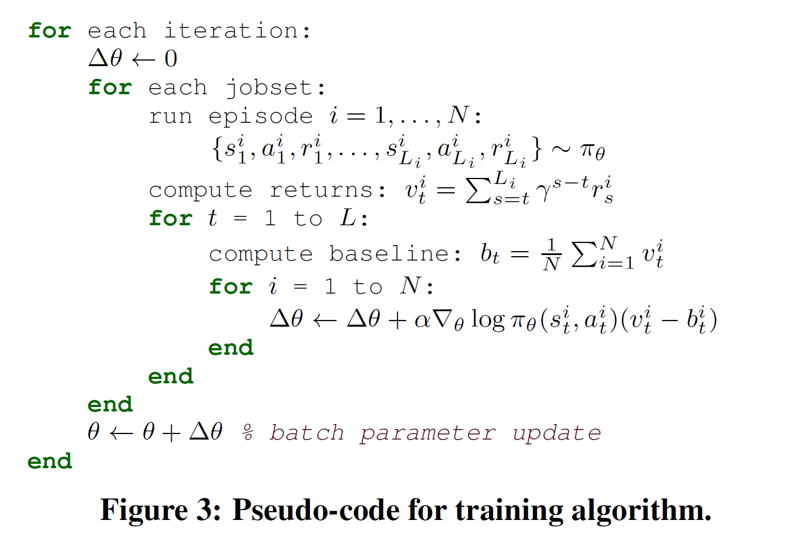
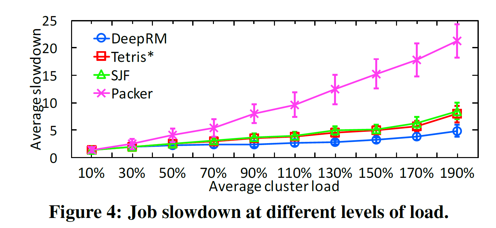
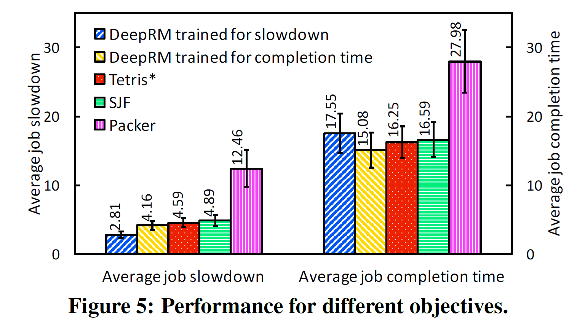
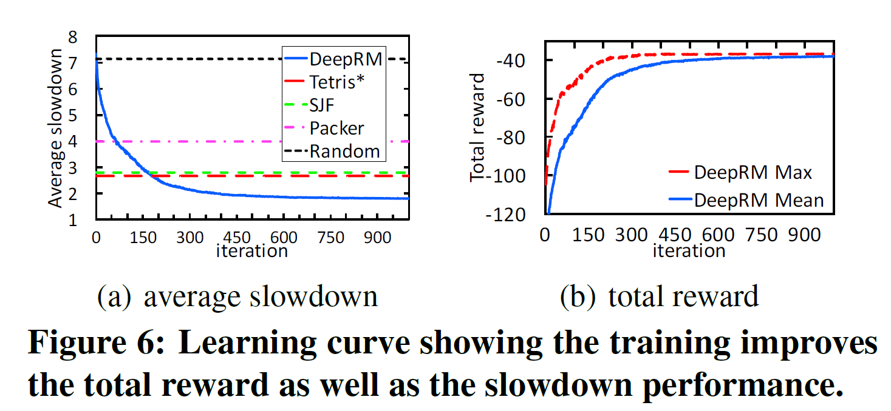
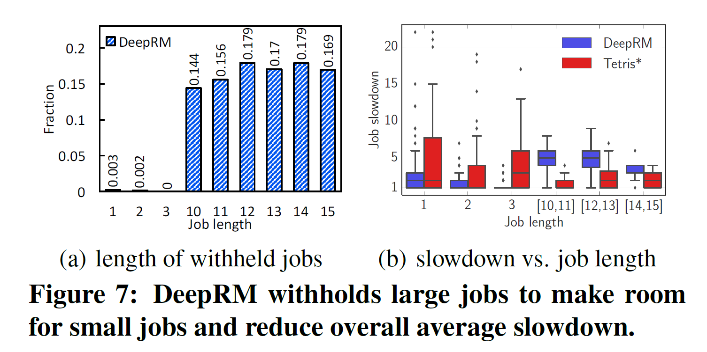

# Resource Management with Deep Reinforcement Learning

> Abstract– Resource management problems in systems and networking often manifest as difficult online decision making tasks where appropriate solutions depend on understanding the workload and environment. Inspired by recent advances in deep reinforcement learning for AI problems, we consider building systems that learn to manage resources directly from experience. We present DeepRM, an example solution that translates the problem of packing tasks with multiple resource demands into a learning problem. Our initial results show that DeepRM performs comparably to state-oftheart heuristics, adapts to different conditions, converges quickly, and learns strategies that are sensible in hindsight.

摘要–系统和网络中的资源管理问题通常表现为困难的在线决策任务，其中适当的解决方案取决于对工作量和环境的理解。受AI问题深度强化学习的最新进展启发，我们考虑构建可直接从经验中学习管理资源的系统。我们提供DeepRM，这是一个示例解决方案，可以将具有多种资源需求的打包任务的问题转换为学习问题。我们的初步结果表明，DeepRM与最新的启发式算法具有可比性，可以适应不同的条件，可以快速收敛，并且可以学习事后明智的策略。

## 1. INTRODUCTION

> Resource management problems are ubiquitous in computer systems and networks. Examples include job scheduling in compute clusters [17], bitrate adaptation in video streaming [23, 39], relay selection in Internet telephony [40], virtual machine placement in cloud computing [20, 6], congestion control [38, 37, 13], and so on. The majority of these problems are solved today using meticulously designed heuristics. Perusing recent research in the field, the typical design flow is: (1) come up with clever heuristics for a simplified model of the problem; and (2) painstakingly test and tune the heuristics for good performance in practice. This process often has to be repeated if some aspect of the problem such as the workload or the metric of interest changes.
>
> We take a step back to understand some reasons for why real world resource management problems are challenging:
>
> 1. The underlying systems are complex and often impossible to model accurately. For instance, in cluster scheduling, the running time of a task varies with data locality,server characteristics, interactions with other tasks, and interference on shared resources such as CPU caches, network bandwidth, etc [12, 17].
> 2. Practical instantiations have to make online decisions with noisy inputs and work well under diverse conditions. A video streaming client, for instance, has to choose the bitrate for future video chunks based on noisy forecasts of available bandwidth [39], and operate well for different codecs, screen sizes and available bandwidths (e.g., DSL vs. T1).
> 3. Some performance metrics of interest, such as tail performance [11], are notoriously hard to optimize in a principled manner.

资源管理问题在计算机系统和网络中无处不在。示例包括计算集群中的作业调度[17]，视频流中的比特率自适应[23、39]，互联网电话中的中继选择[40]，云计算中的虚拟机放置[20、6]，拥塞控制[38、37，13]，等等。今天，这些问题中的大多数都是使用精心设计的启发式方法解决的。仔细研究该领域的最新研究，典型的设计流程是：（1）提出了巧妙的启发式方法来简化问题模型；（2）认真测试和调整启发式方法，以在实践中取得良好的性能。如果问题的某些方面（例如工作量或兴趣度量）发生变化，则通常必须重复此过程。

我们退后一步来了解现实世界中的资源管理问题为何具有挑战性的一些原因：

1. 基础系统很复杂，通常无法准确建模。例如，在集群调度中，任务的运行时间随数据位置，服务器特性，与其他任务的交互以及对共享资源（如CPU缓存，网络带宽等）的干扰而变化[12，17]。
2. 实际实例化必须做出带有噪声输入的在线决策，并且必须在各种条件下都能正常工作。例如，视频流客户端必须根据对可用带宽的嘈杂预测来选择未来视频块的比特率[39]，并且必须在不同的编解码器，屏幕尺寸和可用带宽（例如DSL与T1）之间运行良好。
3. 众所周知，一些令人感兴趣的性能指标，例如尾翼性能[11]，很难以有原则的方式进行优化。

> In this paper, we ask if machine learning can provide a viable alternative to human-generated heuristics for resource management. In other words: Can systems learn to manage resources on their own?
>
> This may sound like we are proposing to build Skynet [1], but the recent success of applying maching learning to other challenging decision-making domains [29, 33, 3] suggests that the idea may not be too far-fetched. In particular, Reinforcement Learning (RL) (§2) has become an active area in machine learning research [30, 28, 32, 29, 33]. RL deals with agents that learn to make better decisions directly from experience interacting with the environment. The agent starts knowing nothing about the task at hand and learns by reinforcement — a reward that it receives based on how well it is doing on the task. RL has a long history [34], but it has recently been combined with Deep Learning techniques to great effect in applications such as playing video games [30], Computer Go [33], cooling datacenters [15], etc.

在本文中，我们询问机器学习是否可以为人为启发式资源管理提供一种可行的替代方法。换句话说：系统是否可以学习自行管理资源？

听起来好像我们正在提议构建天网[1]，但是最近将行进式学习应用于其他具有挑战性的决策领域[29、33、3]的成功表明，这个想法可能不会太牵强。特别是，强化学习（RL）（§2）已成为机器学习研究中的活跃领域[30，28，32，29，33]。RL与能够直接从与环境互动的经验中学习做出更好决策的代理商打交道。代理开始对手头的任务一无所知，并通过强化学习—基于其在该任务上做得如何的奖励。RL历史悠久[34]，但最近已与深度学习技术相结合，在诸如玩视频游戏[30]，Computer Go [33]，冷却数据中心[15]等应用中发挥了巨大作用。

> Revisiting the above challenges, we believe RL approaches are especially well-suited to resource management systems. First, decisions made by these systems are often highly repetitive, thus generating an abundance of training data for RL algorithms (e.g., cluster scheduling decisions and the resulting performance). Second, RL can model complex systems and decision-making policies as deep neural networks analogous to the models used for game-playing agents [33, 30]. Different “raw” and noisy signals1 can be incorporated as input to these neural networks, and the resultant strategy can be used in an online stochastic environment. Third, it is possible to train for objectives that are hard-to-optimize directly because they lack precise models if there exist reward signals that correlate with the objective. Finally, by continuing to learn, an RL agent can optimize for a specific workload (e.g., small jobs, low load, periodicity) and be graceful under varying conditions.
>
> As a first step towards understanding the potential of RL for resource management, we design (§3) and evaluate (§4) DeepRM, a simple multi-resource cluster scheduler. DeepRM operates in an online setting where jobs arrive dynamically and cannot be preempted once scheduled. DeepRM learns to optimize various objectives such as minimizing average job slowdown or completion time. We describe the model in §3.1 and how we pose the scheduling task as an RL problem in §3.2. To learn, DeepRM employs a standard policy gradient reinforcement learning algorithm [35] described in §3.3.

回顾上述挑战，我们认为RL方法特别适合于资源管理系统。首先，由这些系统做出的决策通常是高度重复的，从而为RL算法生成了大量的训练数据（例如，集群调度决策和所产生的性能）。其次，RL可以将复杂的系统和决策策略建模为类似于用于游戏代理的模型的深层神经网络[33，30]。可以将不同的“原始”和嘈杂信号1合并为这些神经网络的输入，并且所得策略可以在在线随机环境中使用。第三，可以训练难以直接优化的目标，因为如果存在与目标相关的奖励信号，则它们缺乏精确的模型。最后，通过继续学习，RL代理可以针对特定的工作负载（例如，小工作，低负载，周期性）进行优化，并在变化的条件下保持优雅。

作为了解RL在资源管理方面的潜力的第一步，我们设计（§3）和评估（§4）DeepRM，它是一种简单的多资源集群调度程序。DeepRM在在线设置下运行，其中作业动态到达，并且一旦计划就无法抢占。DeepRM学会优化各种目标，例如最大程度地减少平均作业速度或完成时间。我们将在第3.1节中描述模型，并在第3.2节中将调度任务作为RL问题来处理。要学习，DeepRM采用第3.3节中描述的标准策略梯度强化学习算法[35]。

> We conduct simulated experiments with DeepRM on a synthetic dataset. Our preliminary results show that across a wide range of loads, DeepRM performs comparably or better than standard heuristics such as Shortest-Job-First (SJF) and a packing scheme inspired by Tetris [17]. It learns strategies such as favoring short jobs over long jobs and keeping some resources free to service future arriving short jobs directly from experience. In particular, DeepRM does not require any prior knowledge of the system’s behavior to learn these strategies. Moreover, DeepRM can support a variety of objectives just by using different reinforcement rewards.
>
> Looking ahead, deploying an RL-based resource manager in real systems has to confront additional challenges. To name a few, simple heuristics are often easier to explain, understand, and verify compared to an RL-based scheme. Heuristics are also easier to adopt incrementally. Nevertheless, given the scale and complexity of many of the resource management problems that we face today, we are enticed by the possibility to improve by using reinforcement learning.

我们在综合数据集上使用DeepRM进行了模拟实验。我们的初步结果表明，在广泛的负载范围内，DeepRM的性能与标准启发式算法（例如，最短工作优先（SJF）和受Tetris启发的打包方案）相当或更好。它学习一些策略，例如从长期的工作中偏爱短期的工作，以及保留一些资源直接根据经验来为将来到达的短期工作提供服务。特别是，DeepRM不需要任何有关系统行为的先验知识即可学习这些策略。而且，DeepRM可以通过使用不同的强化奖励来支持各种目标。

展望未来，在实际系统中部署基于RL的资源管理器必须面对其他挑战。仅举几例，与基于RL的方案相比，简单的启发式方法通常更易于解释，理解和验证。启发式方法也更容易逐步采用。但是，考虑到我们当今面临的许多资源管理问题的规模和复杂性，我们对使用强化学习来改善的可能性很感兴趣。

## 2. BACKGROUND

> We briefly review Reinforcement Learning (RL) techniques that we build on in this paper; we refer readers to [34] for a detailed survey and rigorous derivations.
>
> **Reinforcement Learning.** Consider the general setting shown in Figure 1 where an agent interacts with an environment. At each time step $t$, the agent observes some state $s_t$, and is asked to choose an action $a_t$. Following the action, the state of the environment transitions to $s_{t+1}$ and the agent receives reward $r_t$. The state transitions and rewards are stochastic and are assumed to have the Markov property; i.e. the state transition probabilities and rewards depend only on the state of the environment $s_t$ and the action taken by the agent $a_t$.
>
>  It is important to note that the agent can only control its actions, it has no apriori knowledge of which state the environment would transition to or what the reward may be. By interacting with the environment, during training, the agent can observe these quantities. The goal of learning is to maximize the expected cumulative discounted reward: $\mathbb{E}[\sum_{t=0}^\infin \gamma^tr_t]$, where   $\gamma \in (0,1]$ is a factor discounting future rewards.

我们简要回顾了本文所基于的强化学习（RL）技术。我们请读者参考[34]进行详细的调查和严格的推导。

**强化学习.**考虑图1所示的一般设置，其中代理与环境进行交互。在每个时间步骤$ t $，代理观察到某个状态$ s_t $，并被要求选择一个动作$ a_t $。在执行该操作之后，环境状态将转换为$ s_ {t + 1} $，并且代理会收到奖励$ r_t $。状态转换和奖励是随机的，并假定具有马尔可夫性质。即状态转换的概率和奖励仅取决于环境的状态$ s_t $和代理$ a_t $采取的行动。

重要的是要注意，代理只能控制其动作，它不具有先验知识，即环境将过渡到哪个状态或获得的奖励是什么。通过与环境互动，在训练过程中，特工可以观察到这些数量。学习的目标是使预期的累积折扣奖励最大化：$\mathbb{E}[\sum_{t=0}^\infin \gamma^tr_t]$，其中$\gamma \in (0,1]$是未来奖励的折扣因子。

> **Policy.** The agent picks actions based on a policy, defined as a probability distribution over actions $\pi$ : $\pi(s,a) \to [0,1]$; $\pi(s,a)$ is the probability that action $a$ is taken in state $s$. In most problems of practical interest, there are many possible {state, action} pairs; up to $2^{100}$ for the problem we consider in this paper (see §3). Hence, it is impossible to store the policy in tabular form and it is common to use function approximators [7, 27]. A function approximator has a manageable number of adjustable parameters, $\theta$; we refer to these as the policy parameters and represent the policy as $\pi_{\theta}(s,a)$. The justification for approximating the policy is that the agent should take similar actions for “close-by" states.
>
> Many forms of function approximators can be used to represent the policy. For instance, linear combinations of features of the state/action space (i.e., $\pi_{\theta}(s,a) = \theta^T \phi(s,a)$) are a popular choice. Deep Neural Networks (DNNs) [18] have recently been used successfully as function approximators to solve large-scale RL tasks [30, 33]. An advantage of DNNs is that they do not need hand-crafted features. Inspired by these successes, we use a neural network to represent the policy in our design; the details are in §3.

**策略.**代理根据策略选择动作，该策略定义为动作$ \pi $的概率分布：$\pi(s,a) \to [0,1]$; $\pi(s,a)$ 是在状态$ s $中采取行动$ a $的概率。在大多数具有实际意义的问题中，有许多可能的{state，action}对；对于我们在本文中考虑的问题，最高为$ 2 ^ {100} $（请参阅第3节）。因此，不可能以表格形式存储策略，并且通常使用函数逼近器[7，27]。函数逼近器具有可管理数量的可调参数$ \theta $；我们将其称为策略参数，并将策略表示为$ \pi _ {\theta}(s,a)$。近似该策略的理由是，代理对于“关闭”状态应采取类似的措施。

可以使用多种形式的函数逼近器来表示策略。例如，状态/动作空间的特征的线性组合（即$\pi_{\theta}(s,a) = \theta^T \phi(s,a)$）是一种流行的选择。深度神经网络（DNN）[18]最近已成功用作函数逼近器，以解决大规模RL任务[30，33]。DNN的优点是它们不需要手工制作的功能。受这些成功的启发，我们使用神经网络来表示设计中的策略。有关详细信息，请参见§3。

> **Policy gradient methods.** We focus on a class of RL algorithms that learn by performing gradient-descent on the policy parameters. Recall that the objective is to maximize the expected cumulative discounted reward; the gradient of this objective given by [34]:
> $$
> \nabla_{\theta} \mathbb{E}_{\pi_{\theta}}\left[\sum_{t=0}^{\infty} \gamma^{t} r_{t}\right]=\mathbb{E}_{\pi_{\theta}}\left[\nabla_{\theta} \log \pi_{\theta}(s, a) Q^{\pi_{\theta}}(s, a)\right]
> $$
> Here, $Q^{\pi\theta}(s,a)$ is the expected cumulative discounted reward from (deterministically) choosing action $a$ in state $s$, and subsequently following policy $\pi_\theta$. The key idea in policy gradient methods is to estimate the gradient by observing the trajectories of executions that are obtained by following the policy. In the simple Monte Carlo Method [19], the agent samples multiple trajectories and uses the empirically computed cumulative discounted reward, $v_t$, as an unbiased estimate of $Q^{\pi\theta}(s_t,a_t)$. It then updates the policy parameters via gradient descent:
> $$
> \theta \leftarrow \theta+\alpha \sum_{t} \nabla_{\theta} \log \pi_{\theta}\left(s_{t}, a_{t}\right) v_{t} 
> $$
> where $\alpha$ is the step size. This equation results in the well-known REINFORCE algorithm [35], and can be intuitively understood as follows. The direction $\nabla_{\theta} \log \pi_{\theta}\left(s_{t}, a_{t}\right)$ gives how to change the policy parameters in order to increase $\pi_\theta(s_t,a_t)$ (the probability of action $a_t$ at state $s_t$). Equation 2 takes a step in this direction; the size of the step depends on how large is the return $v_t$. The net effect is to reinforce actions that empirically lead to better returns. In our design, we use a slight variant [32] that reduces the variance of the gradient estimates by subtracting a baseline value from each return $v_t$. More details follow.

**策略梯度方法.**我们专注于一类RL算法，该算法通过对策略参数执行梯度下降来学习。回想一下，目标是使预期的累积折扣奖励最大化。该目标的梯度由[34]给出：
$$
\nabla_{\theta} \mathbb{E}_{\pi_{\theta}}\left[\sum_{t=0}^{\infty} \gamma^{t} r_{t}\right]=\mathbb{E}_{\pi_{\theta}}\left[\nabla_{\theta} \log \pi_{\theta}(s, a) Q^{\pi_{\theta}}(s, a)\right]
$$
在此，$ Q ^ {\pi \theta}(s,a)$是（确定地）选择状态$ s $中的动作$ a $并随后遵循策略$ \pi_ \theta $的预期累积折扣奖励。策略渐变方法中的关键思想是通过观察遵循策略获得的执行轨迹来估计渐变。在简单的蒙特卡洛方法[19]中，代理对多个轨迹进行采样，并使用经验计算的累积折现奖励$ v_t $作为$ Q ^ {\pi \theta}(s_t,a_t)$的无偏估计。然后，它通过梯度下降来更新策略参数：
$$
\theta \leftarrow \theta+\alpha \sum_{t} \nabla_{\theta} \log \pi_{\theta}\left(s_{t}, a_{t}\right) v_{t} \tag{2}
$$
其中$ \alpha $是步长。该方程式产生了众所周知的REINFORCE算法[35]，可以直观地理解如下。方向$\nabla_{\theta} \log \pi_{\theta}\left(s_{t}, a_{t}\right)$提供了如何去为了增加$\pi_\theta(s_t,a_t)$（在状态$ s_t $处动作$ a_t $的概率）改变策略参数。等式2朝这个方向迈出了一步。步骤的大小取决于返回$ v_t $的大小。最终结果是加强采取行动，凭经验得出更好的回报。在我们的设计中，我们使用一个轻微的变量[32]，该变量通过从每个返回$ v_t $中减去基线值来减小梯度估计的方差。接下来是更多细节。

## 3. DESIGN

> In this section, we present our design for online multiresource cluster scheduling with RL.We formulate the problem (x3.1) and describe how to represent it as an RL task (x3.2). We then outline our RL-based solution (x3.3) building on the machinery described in the previous section.

在本节中，我们介绍了使用RL进行在线多资源集群调度的设计，我们提出了问题（x3.1）并描述了如何将其表示为RL任务（x3.2）。然后，我们在上一节中介绍的机器上概述基于RL的解决方案（x3.3）。

### 3.1 Model

> We consider a cluster with $d$ resource types (e.g., CPU, memory, I/O). Jobs arrive to the cluster in an online fashion in discrete timesteps. The scheduler chooses one or more of the waiting jobs to schedule at each timestep. Similar to prior work [17], we assume that the resource demand of each job is known upon arrival; more specifically, the resource profile of each job $j$ is given by the vector $\mathbf{r}_{j}=\left(r_{j, 1}, \ldots, r_{j, d}\right)$ of resources requirements, and $T_j$ – the *duration* of the job. For simplicity, we assume no preemption and a fixed allocation profile (i.e., no malleability), in the sense that $\mathbf{r}_j$ must be allocated continuously from the time that the job starts execution until completion. Further, we treat the cluster as a single collection of resources, ignoring machine fragmentation effects. While these aspects are important for a practical job scheduler, this simpler model captures the essential elements of multi-resource scheduling and provides a non-trivial setting to study the effectiveness of RL methods in this domain. We discuss how the model can be made more realistic in §5.
>
> **Objective.** We use the average job slowdown as the primary system objective. Formally, for each job $j$, the slowdown is given by $S_j = C_j=T_j$ ; where $C_j$ is the completion time of the job (i.e., the time between arrival and completion of execution) and $T_j$ is the (ideal) duration of the job; note that $S_j \ge 1$. Normalizing the completion time by the job’s duration prevents biasing the solution towards large jobs, which can occur for objectives such as mean completion time.

我们考虑具有$ d $种资源类型（例如，CPU，内存，I / O）的集群。作业以离散的时间步长以在线方式到达集群。调度程序在每个时间步选择一个或多个等待作业进行调度。类似于先前的工作[17]，我们假设到达时知道每个工作的资源需求；更具体地说，每个作业$ j $的资源配置文件由的资源需求向量$ \mathbf{r}_{j}=\left(r_{j, 1}, \ldots, r_{j, d}\right)$给出，以及$ T_j $ –作业的*持续时间*。为简单起见，我们假设没有抢占和固定的分配配置文件（即没有延展性），在这个意义上，$\mathbf{r}_j$从作业开始执行到完成为止，必须连续分配。此外，我们将集群视为资源的单个集合，而忽略了机器碎片的影响。尽管这些方面对于实际的作业调度程序很重要，但此较简单的模型捕获了多资源调度程序的基本要素，并为研究RL方法在此领域的有效性提供了重要的设置。我们将在§5中讨论如何使模型更加实际。

**目标.**我们将平均作业减速情况作为主要系统目标。正式地，对于每个作业$ j $，减速由$ S_j = C_j = T_j $给出；其中$ C_j $是作业的完成时间（即到达和完成执行之间的时间），而$ T_j $是作业的（理想）持续时间；注意$ S_j \ge 1 $。根据工作时间对完成时间进行归一化可以防止将解决方案偏向大型工作，这可能会发生在诸如平均完成时间之类的目标上。

### 3.2 RL formulation

> **State space.** We represent the state of the system—the current allocation of cluster resources and the resource profiles of jobs waiting to be scheduled — as distinct images (see Figure 2 for illustration). The cluster images (one for each resource; two leftmost images in the figure) show the allocation of each resource to jobs which have been scheduled for service, starting from the current timestep and looking ahead $T$ timesteps into the future. The different colors within these images represent different jobs; for example, the red job in Figure 2 is scheduled to use two units of CPU, and one unit of memory for the next three timesteps. The job slot images represent the resource requirements of awaiting jobs. For example, in Figure 2, the job in Slot 1 has a duration of two timesteps, in which it requires two units of CPU and one unit of memory.
>
> Ideally, we would have as many job slot images in the state as there are jobs waiting for service. However, it is desirable to have a fixed state representation so that it can be applied as input to a neural network. Hence, we maintain images for only the first $M$ jobs to arrive (which have not yet been scheduled). The information about any jobs beyond the first $M$ is summarized in the *backlog* component of the state, which simply counts the number of such jobs. Intuitively, it is sufficient to restrict attention to the earlier-arriving jobs because plausible policies are likely to prefer jobs that have been waiting longer. This approach also has the added advantage of constraining the action space (see below) which makes the learning process more efficient.

**状态空间.**我们将系统状态（集群资源的当前分配以及等待调度的作业的资源配置文件）表示为不同的图像（请参见图2）。群集图像（每个资源一个图像；图中最左边的两个图像）显示了从当前时间段开始，到未来的$ T $时间步长，将每个资源分配给已计划服务的作业。这些图像中不同的颜色代表不同的工作。例如，图2中的红色作业计划在接下来的三个时间步使用两个CPU单元和一个内存单元。作业插槽图像代表等待作业的资源需求。例如，在图2中，插槽1中的作业具有两个时间步长，其中需要两个CPU单元和一个内存单元。

理想情况下，状态中的作业槽位映像数量与等待服务的作业数量一样多。但是，希望具有固定状态表示，以便可以将其用作神经网络的输入。因此，我们仅维护要到达的第一个$ M $作业的图像（尚未计划）。状态的*backlog*部分汇总了除第一个$ M $之外的任何作业的信息，该信息仅计算此类作业的数量。从直觉上讲，将注意力集中在较早到达的工作上就足够了，因为合理的政策可能更喜欢等待时间更长的工作。这种方法还具有限制动作空间（参见下文）的附加优势，这使学习过程更加有效。

> **Action space. **At each point in time, the scheduler may want to admit any subset of the $M$ jobs. But this would require a large action space of size $2^M$ which could make learning very challenging. We keep the action space small using a trick: we allow the agent to execute more than one action in each timestep. The action space is given by $\{\emptyset,1,...,M\}$, where $a = i$ means “schedule the job at the $i$-th slot”; and $a=\emptyset$ is a “void” action that indicates that the agent does not wish to schedule further jobs in the current timestep. At each timestep, time is frozen until the scheduler either chooses the void action, or an invalid action (e.g., attempting to schedule a job that does not “fit” such as the job at Slot 3 in Figure 2). With each valid decision, one job is scheduled in the first possible timestep in the cluster (i.e., the first timestep in which the job’s resource requirements can be fully satisfied till completion). The agent then observes a state transition: the scheduled job is moved to the appropriate position in the cluster image. Once the agent picks $a=\emptyset$ or an invalid action, time actually proceeds: the cluster images shift up by one timestep and any newly arriving jobs are revealed to the agent. By decoupling the agent’s decision sequence from real time, the agent can schedule multiple jobs at the same timestep while keeping the action space linear in $M$.

**动作空间.**在每个时间点，调度程序都可能希望接受$ M $作业的任何子集。但这将需要较大的动作空间，大小为$ 2 ^ M $，这可能会使学习变得非常具有挑战性。我们使用一个技巧来使动作空间保持较小：我们允许代理在每个时间步执行多个动作。动作空间由$ \{\emptyset,1,...,M \} $给出，其中$ a = i $表示“将作业安排在第$ i $个插槽中”；$ a = \emptyset $是“空”操作，指示代理不希望在当前时间步长安排更多作业。在每个时间步长，时间将被冻结，直到调度程序选择空动作或无效动作（例如，尝试调度不“适合”的作业，例如图2中的插槽3的作业）。有了每个有效的决定，就可以在集群中的第一个可能的时间步（即可以完全满足任务的资源要求直到完成）的第一个时间步中调度一个作业。然后，代理会观察到状态转换：调度的作业将移动到群集映像中的适当位置。代理选择$ a = \emptyset $或无效操作后，时间实际上就会继续：集群映像会向上移动一个时间步，并且所有新到达的作业都会显示给代理。通过将座席的决策序列与实时解耦，座席可以在同一时间步安排多个作业，同时使在$M$上操作空间保持线性。

> **Rewards.** We craft the reward signal to guide the agent towards good solutions for our objective: minimizing average slowdown. Specifically, we set the reward at each timestep to$\sum_{j \in \mathcal{J} } \frac{-1}{T_{j} }$ , where $\mathcal J$ is the set of jobs currently in the system (either scheduled or waiting for service). The agent does not receive any reward for intermediate decisions during a timestep (see above). Observe that setting the discount factor  $\gamma = 1$, the cumulative reward over time coincides with (negative) the sum of job slowdowns, hence maximizing the cumulative reward mimics minimizing the average slowdown.

**奖励.**我们会制定奖励信号，以指导代理为我们的目标找到好的解决方案：最小化平均下降速度。具体来说，我们将每个时间步长的奖励设置为$\sum_{j \in \mathcal{J} } \frac{-1}{T_{j} }$，其中$ \mathcal J $是当前在系统中的作业集合（已调度或正在等待服务）。在某个时间步长中，代理不会因中间决策而获得任何奖励（请参见上文）。观察到，设置折扣因子$ \gamma = 1 $，随时间的累积奖励与作业下降速度的总和（负）重合，因此最大化累积奖励可以使平均下降速度最小化。

### 3.3 Training algorithm

> We represent the policy as a neural network (called policy network) which takes as input the collection of images described above, and outputs a probability distribution over all possible actions. We train the policy network in an episodic setting. In each episode, a fixed number of jobs arrive and are scheduled based on the policy, as described in x3.2. The episode terminates when all jobs finish executing.
>
> To train a policy that generalizes, we consider multiple examples of job arrival sequences during training, henceforth called jobsets. In each training iteration, we simulate $N$ episodes for each jobset to explore the probabilistic space of possible actions using the current policy, and use the resulting data to improve the policy for all jobsets. Specifically, we record the state, action, and reward information for all timesteps of each episode, and use these values to compute the (discounted) cumulative reward, $v_t$, at each timestep $t$ of each episode. We then train the neural network using a variant of the REINFORCE algorithm described in x2.
>
> Recall that REINFORCE estimates the policy gradient using Equation (2). A drawback of this equation is that the gradient estimates can have high variance. To reduce the variance, it is common to subtract a baseline value from the returns, $v_t$. The baseline can be calculated in different ways. The simple approach that we adopt is to use the average of the return values, $v_t$, where the average is taken at the same timestep $t$ across all episodes4 with the same jobset (a similar approach has been used in [32]). Figure 3 shows the pseudo-code for the training algorithm.

我们将策略表示为神经网络（称为策略网络），该神经网络将上述图像的集合作为输入，并输出所有可能动作的概率分布。我们在情景环境中训练策略网络。在每个情节中，都有固定数量的作业到达，并根据策略进行调度，如x3.2中所述。当所有作业完成执行时，情节终止。

为了训练通用的策略，我们考虑训练过程中作业到达顺序的多个示例，以下称为工作集。在每个训练迭代中，我们为每个作业集模拟$ N $个情节，以探索使用当前策略的可能动作的概率空间，并使用所得数据来改善所有作业集的策略。具体来说，我们记录每个情节的所有时间步的状态，动作和奖励信息，并使用这些值来计算每个情节的每个时间步$ t $的（折扣）累积奖励$ v_t $。然后，我们使用x2中描述的REINFORCE算法的变体训练神经网络。

回想一下，REINFORCE使用公式（2）估算策略梯度。该方程的缺点是梯度估计可能具有高方差。为了减少方差，通常会从收益$ v_t $中减去基线值。基线可以以不同方式计算。我们采用的简单方法是使用返回值的平均值$ v_t $，其中平均值是在具有相同工作集的所有情节的相同时间步长$ t $上进行的（[32]中使用了类似的方法）。图3显示了训练算法的伪代码。

### 3.4 Optimizing for other objectives

> The RL formulation can be adapted to realize other objectives. For example, to minimize average completion time, we can use $-\vert\mathcal J\vert$(negative the number of unfinished jobs in the system) for the reward at each timestep. To maximize resource utilization, we could reward the agent for the sum of the resource utilizations at each timestep. The makespan for a set of jobs can also be minimized by penalizing the agent one unit for each timestep for which unfinished jobs exist.

RL公式可以调整以实现其他目标。例如，为了最小化平均完成时间，我们可以在每个时间步使用$-| \mathcal J | $（系统中未完成的工作数的负数）作为奖励。为了最大程度地利用资源，我们可以奖励代理每个时间步的资源利用率之和。通过对存在未完成工作的每个时间步长向代理人处以一个单位的罚款，还可以将一组工作的完成时间最小化。

## 4. EVALUATION

> We conduct a preliminary evaluation of DeepRM to answer the following questions.
> - When scheduling jobs that use multiple resources, how does DeepRM compare with state-of-the-art mechanisms?
> - Can DeepRM support different optimization objectives?
> - Where do the gains come from?
> - How long does DeepRM take to train?

我们对DeepRM进行了初步评估，以回答以下问题。
- 在计划使用多个资源的作业时，DeepRM与最新机制相比如何？
- DeepRM是否可以支持不同的优化目标？
- 收益来自何处？
- DeepRM需要多长时间训练？

### 4.1 Methodology

> **Workload.** We mimic the setup described in §3.1. Specifically, jobs arrive online according to a Bernoulli process. The average job arrival rate is chosen such that the average load varies between 10% to 190% of cluster capacity. We assume two resources, i.e., with capacity $\{1r,1r\}$. Job durations and resource demands are chosen as follows: 80% of the jobs have duration uniformly chosen between $1t$ and $3t$; the remaining are chosen uniformly from $10t$ to $15t$. Each job has a dominant resource which is picked independently at random. The demand for the dominant resource is chosen uniformly between $0.25r$ and $0.5r$ and the demand of the other resource is chosen uniformly between $0.05r$ and $0.1r$.

**工作量.**我们模仿第3.1节中所述的设置。具体来说，工作是根据伯努利过程在线到达的。选择平均作业到达率，以使平均负载在群集容量的10％到190％之间变化。我们假设两个资源，即容量为$ \{1r，1r \} $。工作时间和资源需求的选择如下：80％的工作时间在$ 1t $和$ 3t $之间均匀选择；其余的从$ 10t $到$ 15t $统一选择。每个工作都有一个主导资源，该资源是随机独立选择的。对主导资源的需求在$ 0.25r $和$ 0.5r $之间统一选择，而其他资源的需求在$ 0.05r $和$ 0.1r $之间统一选择。

> **DeepRM.** We built the DeepRM prototype described in §3 using a neural network with a fully connected hidden layer with 20 neurons, and a total of 89,451 parameters. The “images” used by the DeepRM agent are $20t$ long and each experiment lasts for $50t$. Recall that the agent allocates from a subset of $M$ jobs (we use $M = 10$) but can also observe the number of other jobs (“backlog” which we set to 60 jobs). We use 100 different jobsets during training. In each training iteration, per jobset we run $N = 20$ Monte Carlo simulations in parallel. We update the policy network parameters using the rmsprop [21] algorithm with a learning rate of 0.001. Unless otherwise specified, the results below are from training DeepRM for 1000 training iterations.

**DeepRM.** 我们使用神经网络构建了§3中描述的DeepRM原型，该神经网络具有20个神经元和总共89,451个参数的完全连接的隐藏层。DeepRM代理使用的“图像”长$ 20t $，每个实验持续$ 50t $。回想一下，代理从$ M $个作业的子集进行分配（我们使用$ M = 10 $），但也可以观察其他作业的数量（“积压”，我们将其设置为60个作业）。在培训期间，我们使用100个不同的作业集。在每个训练迭代中，每个作业集我们并行运行$ N = 20 $蒙特卡洛模拟。我们使用rmsprop [21]算法以0.001的学习速率更新策略网络参数。除非另有说明，否则以下结果来自对DeepRM的1000次训练迭代训练。

> **Comparables.** We compare DeepRM against a Shortest Job First (SJF) agent which allocates jobs in increasing order of their duration; a Packer agent which allocates jobs in increasing order of alignment between job demands and resource availability (same as the packing heuristic in [17]); and Tetris, an agent based on Tetris [17] which balances preferences for short jobs and resource packing in a combined score. These agents are all work-conserving, and allocate as many jobs as can be accommodated with the available resources (in the preference order).
>
> **Metrics.** We measure the various schemes on a few different aspects: the average job slowdown (x3.1) and the average job completion time. To observe the convergence behavior of DeepRM, we also measure the total reward achieved at each iteration during training.

**对比.**我们将DeepRM与最短作业优先（SJF）代理进行比较，该代理按其持续时间的增加顺序分配作业；一个Packer代理，它按照工作需求和资源可用性之间的增加顺序来分配工作（与[17]中的打包启发式相同）；俄罗斯方块（Tetris），一种基于俄罗斯方块[17]的代理，在综合得分中平衡了短期工作和资源打包的偏好。这些代理都是节省工作的，并分配可用资源可容纳的尽可能多的作业（按优先顺序）。

**指标.**我们在几个不同方面衡量各种方案：平均作业减速（x3.1）和平均作业完成时间。为了观察DeepRM的收敛行为，我们还测量了训练期间每次迭代获得的总奖励。

### 4.2 Comparing scheduling efficiency

> Figure 4 plots the average job slowdown for DeepRM versus other schemes at different load levels. Each datapoint is an average over 100 new experiments with jobsets not used during training. As expected, we see that (1) the average slowdown increases with cluster load, (2) SJF performs better than Packer because it allocates the smaller jobs first, and (3) Tetris  outperforms both heuristics by combining their advantages. The figure also shows that DeepRM is comparable to and often better than all heuristics. As we will see shortly, DeepRM beats Tetris  at higher loads because it automatically learns to keep some resources free so that small jobs arriving in the near future can be scheduled quickly; with Tetris, small jobs may sometimes have to wait until a (large) existing job finishes because Tetris  enforces work-conservation, which may not always be the best strategy when jobs cannot be preempted. Remarkably, DeepRM is able to learn such strategies directly from experience — without any prior knowledge of what strategies (e.g., favoring shorter jobs) are suitable.

图4绘制了DeepRM与其他方案在不同负载水平下的平均作业速度降低情况。每个数据点平均超过100个新实验，而训练期间未使用这些工作集。正如预期的那样，我们看到（1）平均速度随着群集负载的增加而增加；（2）SJF的性能优于Packer，因为它首先分配了较小的作业，并且（3）Tetris通过结合它们的优势胜过两种启发式方法。该图还显示，DeepRM可与所有启发式算法相媲美，并且往往优于所有启发式方法。正如我们将很快看到的那样，DeepRM在较高的负载下击败了Tetris，因为它会自动学习以保持一些资源的空闲状态，以便可以快速安排在不久的将来到达的小型作业。在俄罗斯方块中，小型作业有时可能要等到一个（大型）现有作业完成后才能执行，因为俄罗斯方块会强制执行工作保护，当无法抢占工作时，这可能并不总是最佳策略。值得注意的是，DeepRM能够直接从经验中学习此类策略，而无需事先知道哪种策略适用（例如，青睐较短的工作）。

> **Other objectives.** Figure 5 shows the behavior for two objectives (average job slowdown and average job completion time) when the cluster is highly loaded (load=130%). Recall that DeepRM uses a different reward function for each objective ($-|\mathcal{J}|$ to optimize average job completion time, and $\sum_{j \in \mathcal{J} \frac{-1}{T_j}}$ for average job slowdown; see x3.4). As before we see that Tetris  outperforms the other heuristics. However, DeepRM is the best performing scheme on each objective when trained specifically to optimize for that objective with the appropriate reward function. Thus DeepRM is customizable for different objectives.

**其他目标.** 图5显示了群集高度负载（负载= 130％）时两个目标的行为（平均作业减速和平均作业完成时间）。回想一下，DeepRM为每个目标使用不同的奖励函数（$-|\mathcal{J}|$优化平均作业完成时间，$\sum_{j \in \mathcal{J} \frac{-1}{T_j}}$用于平均作业减速；参考3.4节）。如前所述，Tetris优于其他启发式算法。但是，经过专门培训以使用适当的奖励功能针对该目标进行优化时，DeepRM是针对每个目标的最佳性能方案。因此，DeepRM可针对不同目标进行定制。

### 4.3 Understanding convergence and gains

> **Convergence behavior.** To understand the convergence behavior of DeepRM, we look deeper into one specific datapoint of Figure 4: training DeepRM to optimize the average job slowdown at a load of 70%. Figure 6(a) plots the average job slowdown achieved by the policy learnt by the end of each iteration. To compare, the figure also plots the values for the other schemes. As expected, we see that DeepRM improves with iteration count; the starting policy at iteration 0 is no better than a random allocation but after 200 iterations DeepRM is better than Tetris.
>
> Would running more iterations further improve the average job slowdown? Figure 6(b) plots the maximum reward across all of the Monte Carlo runs at each iteration and the average reward. As expected, both values increase with iterations as DeepRM’s policy improves. Further, higher rewards, which is what the learning algorithm explicitly optimizes for, correlate with improvements in average job slowdown (Fig. 6(a)). Finally, recall that the policy is a probability distribution over possible actions. Hence, a large gap between the maximum and average rewards implies the need for further learning; if some action path (sampled from the policy output by the neural network) is much better than the average action path, there is room to increase reward by adjusting the policy. Conversely, when this gap narrows, the model has converged; as we see near the 1000th iteration.
>
> We have thus far measured number of iterations but how long does one iteration take to compute? Our multi-threaded implementation took 80 seconds per iteration on a 24-core CPU server. Offloading to a GPU server may speedup the process further [10, 2]. Finally, note that the policy need only be trained once; retraining is needed only when the environment (cluster or job workload) changes notably.

**收敛行为.**为了了解DeepRM的收敛行为，我们对图4的一个特定数据点进行了更深入的研究：训练DeepRM以优化70％负载下的平均作业速度。图6（a）绘制了每次迭代结束时通过学习的策略实现的平均作业速度下降。为了进行比较，该图还绘制了其他方案的值。不出所料，我们发现DeepRM随着迭代次数的增加而提高。迭代0时的启动策略并不比随机分配好，但是在200次迭代之后，DeepRM优于Tetris。

运行更多的迭代会进一步改善平均作业速度吗？图6（b）绘制了每次迭代中所有蒙特卡洛运行的最大奖励和平均奖励。正如预期的那样，随着DeepRM政策的改进，这两个值都会随着迭代而增加。此外，学习算法明确优化的更高奖励与平均工作速度的降低相关（图6（a））。最后，回想一下，该策略是对可能采取的措施的一种概率分布。因此，最高和平均奖励之间的巨大差距意味着需要进一步学习；如果某个动作路径（从神经网络的策略输出中采样）比平均动作路径好得多，则可以通过调整策略来增加奖励。相反，当差距缩小时，模型收敛。正如我们在第1000次迭代附近看到的那样。

到目前为止，我们已经测量了迭代次数，但是一次迭代要花多长时间？我们的多线程实现在24核CPU服务器上每次迭代花费了80秒。卸载到GPU服务器可以进一步加快该过程[10，2]。最后，请注意，该策略只需训练一次；仅当环境（集群或工作负载）发生显着变化时才需要重新训练。

> Where are the gains from? To understand why DeepRM performs better, we examine the case with load 110%. Recall that, unlike the other schemes, DeepRM is not workconserving, i.e., it can hold a job even if there are enough resources available to allocate it. We found that in 23:4% of timesteps in this scenario, DeepRM was not work-conserving. Whenever DeepRM withholds a job, we record its length, and plot the distribution of the length of such jobs in Figure 7(a). We see that DeepRM almost always withholds only large jobs. The effect is to make room for yet-to-arrive small jobs. This is evident in Figure 7(b): the slowdown for small jobs is significantly smaller with DeepRM than Tetris?, with the tradeoff being higher slowdown for large jobs. Since in this workload (x4.1), there are 4 more small jobs than large jobs, the optimal strategy to minimize average job slowdown (Figure 4) in a heavy load is to keep some resources free so that newly arriving small jobs can be immediately allocated.
> DeepRM learns such a strategy automatically.

从哪里获得收益？要了解DeepRM为什么表现更好，我们检查负载为110％的情况。回想一下，与其他方案不同，DeepRM不能保持工作状态，即即使有足够的资源来分配作业，它也可以保留作业。我们发现，在这种情况下，在23：4％的时间步长中，DeepRM不能保持工作。每当DeepRM保留作业时，我们都会记录其长度，并在图7（a）中绘制此类作业的长度分布。我们看到，DeepRM几乎总是只保留大量工作。结果是为尚未完成的小工作腾出了空间。这在图7（b）中很明显：DeepRM的小型作业的速度要比Tetris？小得多，而权衡是大型作业的速度要高。由于在此工作负载（x4.1）中，小型作业比大型作业多4个，因此在重负载下最大程度地减少平均作业减速的最佳策略（图4）是保持一些资源可用，以便新到的小型作业可以 立即分配。DeepRM会自动学习这种策略。

## 5. DISCUSSION

> We next elaborate on current limitations of our solution, which motivate several challenging research directions.
>
> **Machine boundaries and locality.** Our problem formulation assumes a single “large resource pool"; this abstracts away machine boundaries and potential resource fragmentation. This formulation is more practical than might appear since many cluster schedulers make independent scheduling decisions per machine (e.g., upon a hearbeat from the machine as in YARN [36]). By having the agent allocate only one machine’s worth of resources, the same formulation can be employed in such scenarios. We also currently do not take into account data locality considerations [41, 22]. This can can be done by giving a higher reward to data-local allocations, or perhaps, enabling the agent to learn the true value of data locality with appropriate observation signals.
>
> **Job models.** We did not model inter-task dependencies that are common in data-parallel jobs. For example, jobs may consist of multiple stages, each with many tasks and different resource requirements [17]. Further, the resource profile of a job may not be known in advance (e.g., for non-recurring jobs [4]), and the scheduler might have get an accurate view only as the job runs [14]. The RL paradigm can in principle deal with such situations of partial observability by casting the decision problem as a POMDP [9]. We intend to investigate alternative job models and robustness to uncertainty in resource profiles in future work.
>
> **Bounded time horizon.** Notice that DeepRM uses a small time horizon whereas the underlying optimization problem has an infinite time horizon. The bounded horizon is needed for computing the baseline (see §3.3). We hope to overcome this issue by replacing the time-dependent baseline with a value network [34] that estimates the average return value.

接下来，我们将详细介绍解决方案的当前局限性，这些局限性会激发一些具有挑战性的研究方向。

**机器边界和局部性.**我们的问题公式假设一个“大资源池”；这抽象了机器边界和潜在的资源碎片。由于许多群集调度程序会针对每台机器做出独立的调度决策，因此这种公式的实用性超过了实际表现。例如，根据YARN [36]中的机器发出的声音，通过让代理仅分配一台机器的资源价值，可以在这种情况下采用相同的公式。我们目前也没有考虑数据位置的考虑[[41，22]。可以通过对数据本地分配给予更高的奖励来实现，或者可以使代理使用适当的观察信号来学习数据本地性的真实价值。

**作业模型.**我们没有对数据并行作业中常见的任务间依赖性进行建模。例如，工作可能包含多个阶段，每个阶段都有许多任务和不同的资源需求[17]。此外，可能不预先知道作业的资源简档（例如，对于非周期性作业[4]），并且调度程序可能仅在作业运行时才获得准确的视图[14]。RL范式原则上可以通过将决策问题转换为POMDP来处理部分可观察性的情况[9]。我们打算在未来的工作中研究替代性工作模型和对资源状况不确定性的鲁棒性。

**有限的时间范围.**请注意，DeepRM使用较小的时间范围，而基础的优化问题具有无限的时间范围。计算基线需要边界水平（请参见第3.3节）。我们希望通过用估计平均回报值的价值网络[34]来取代时间相关的基线来克服这个问题。

## 6. RELATED WORK

> RL has been used for a variety of learning tasks, ranging from robotics [25, 24] to industrial manufacturing [26] and computer game playing [34]. Of specific relevance to our work is Zhang and Dietterich’s paper [42] on allocating human resources to tasks before and after NASA shuttle missions. Our job scheduling setup has similarities (e.g., multiple jobs and resources), but differs crucially in being an online problem, whereas the NASA task is offline (all input is known in advance). Some early work uses RL for decentralized packet routing in a switch [8], but the problem sizes were small and neural network machinery was not needed. Recently, learning has been applied to designing congestion control protocols using a large number of offline [37] or online [13] experiments. RL could provide a useful framework for learning such congestion control algorithms as well.
>
> Motivated by the popularity of data-parallel frameworks, cluster scheduling has been studied widely recently. Several scheduler designs address specific issues or objectives, such as fairness [41, 16], locality [22, 41], packing [17] and straggling tasks [5]. We are not aware of any work that applies reinforcement learning for data-parallel cluster scheduling.

RL已用于各种学习任务，从机器人技术[25，24]到工业制造[26]和计算机游戏[34]。与我们的工作特别相关的是Zhang和Dietterich的论文[42]，该论文关于在NASA航天飞机任务前后分配人力资源。我们的工作安排设置具有相似性（例如，多个工作和资源），但是在在线问题上有很大的不同，而NASA任务是离线的（所有输入都是预先知道的）。一些早期的工作将RL用于交换机中的分散式分组路由[8]，但是问题的规模很小，不需要神经网络机制。最近，学习已被用于使用大量离线[37]或在线[13]实验来设计拥塞控制协议。RL可以为学习此类拥塞控制算法提供一个有用的框架。

由于数据并行框架的流行，最近对集群调度进行了广泛的研究。几种调度程序设计解决了特定的问题或目标，例如公平[41、16]，位置[22、41]，打包[17]和分散任务[5]。我们尚无任何将强化学习应用于数据并行集群调度的工作。

## 7. CONCLUSION

> This paper shows that it is feasible to apply state-of-the-art Deep RL techniques to large-scale systems. Our early experiments show that the RL agent is comparable and sometimes better than ad-hoc heuristics for a multi-resource cluster scheduling problem. Learning resource management strategies directly from experience, if we can make it work in a practical context, could offer a real alternative to current heuristic based approaches.

本文表明，将最新的Deep RL技术应用于大规模系统是可行的。我们的早期实验表明，对于多资源集群调度问题，RL代理具有可比性，有时甚至优于临时启发式算法。如果我们能够从实践中直接学习资源管理策略，那么它可以为当前基于启发式方法提供真正的替代方法。

